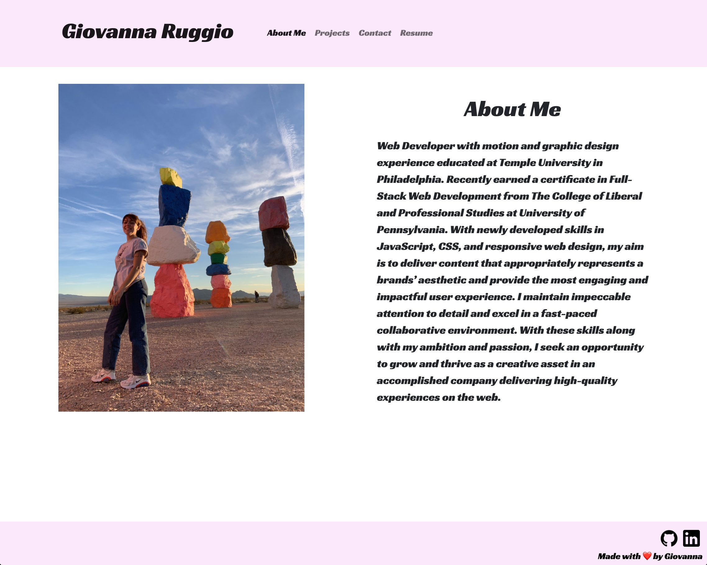

# My Portfolio with React

## Description
Welcome to my very first site with React and my portfolio! This single-page application allows for furture employers to learn more about me as a web developer and access important documents of mine, such as resume and links to GitHub and LinkedIn.

## Table of Contents
- [Installation](#installation) 
- [Visuals](#visuals) 
- [Credits](#credits) 
- [Links](#links)

## Installaion

- GitHub Page
    - https://giovannaruggio.github.io/react-portfolio/

## Visuals

## Credits
Credit to class activites, my amazing instructors and peers!

## Links

- GitHub Repository
    - https://github.com/giovannaruggio/react-portfolio

    

    

